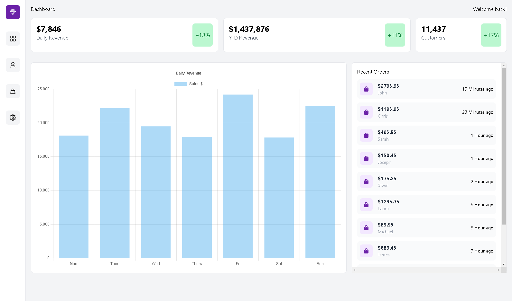
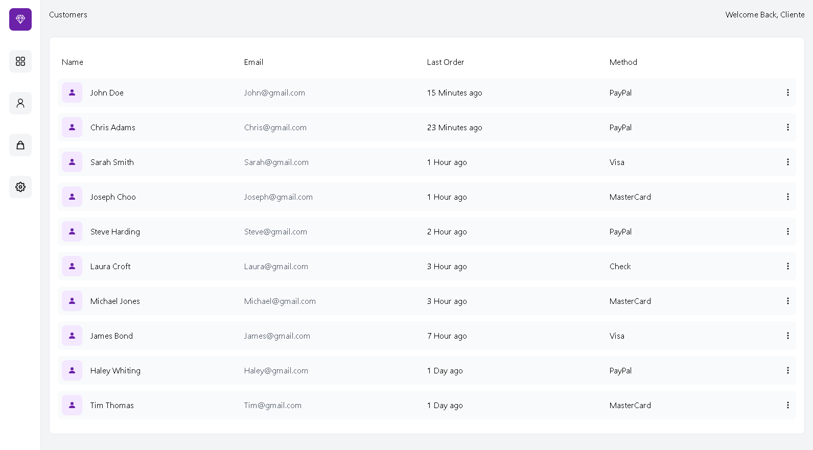
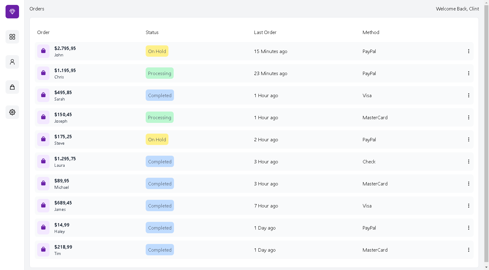

# Dashboard 

In this project I built a fully responsive dashboard using react and tailwindcss, simulating data with static data.



## Technology

- JavaScript
- React
- NextJS
- TailwindCSS
- ChartJS


## Customers



## Orders




## My Contacts

<div align="center">

<h1>Glendson Garcete</h1>
<strong>FullStack Developer</strong>
<br/>
<br/>

<a href="https://www.linkedin.com/in/glendson-zeus-tomazetto-garcete-a2a0b190/" target="_blank">

</a>

<a href="https://github.com/glendson" target="_blank">

</a>

<a href="mailto:gztomazetto@gmail.com?subject=Fala%20Dev" target="_blank">

</a>
</div>


## Getting Started

First, run the development server:

```bash
npm run dev
# or
yarn dev
# or
pnpm dev
```